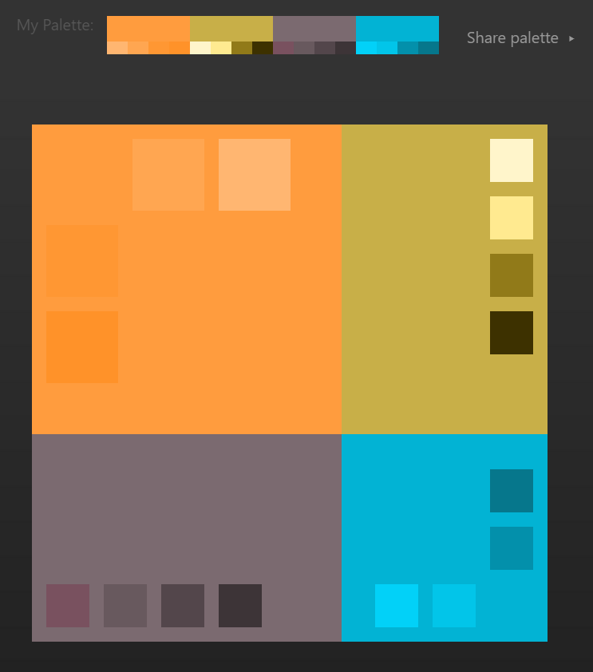
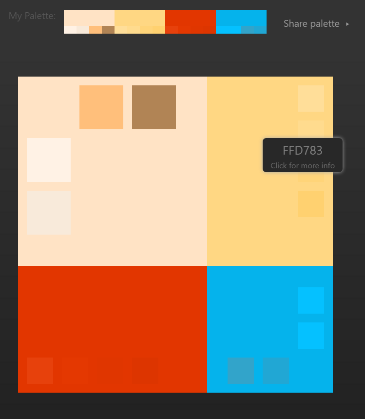

# View
* Provides consistent GUI based on material design. 
* The primary tool to
    * build personal notifications network
    * receive notifications
    * push additional content (text, files, photos, etc) 

        
### App Design
#### Color Palettes
- 
- 
- 

### Desktop Mockup

... **in progress** ..

### View classes
* **Notifications**: displays a log/history of recently pushed/pulled notifications
* **Devices**: displays devices currently connected to the "channel"
* **Apps**: displays device apps and allows for more granular notification routing
* **Settings**: allows for the setup and changes to customize app settings
